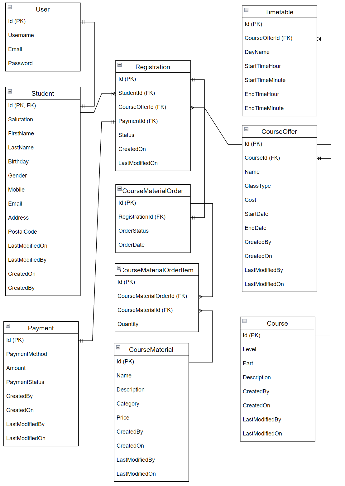

# German Course Registration System
Web application for registering German classes and buying related course materials.

## Table of Contents
* [Introduction](#intro)
* [Technologies](#tech)
* [Setting up and Running the Application](#setup)
* [Entity Relationship Diagram](#erd)
* [Scope of functionalities](#sof)
* [Project Status](#ps)

## Introduction
The web application allows students to register different level of German courses created by admins. The project is created to explore web development, and also to demonstrate what can be achieved using the .net core development in MVC framework with C#.

## Technologies
* Bootstrap 5
* ASP.NET Razor
* ASP.NET Core, Version 7.0
* MVC with C# and Entity Framework
* SQL Server

## Setting up and Running the Application
* **IDEs**: Visual Studio or Visual Studio Code, SQL Server Management Studio
* Download the file or clone the repository
* Setup credentials for super admin at GermanCourseAuthDbContext.cs file under DBContext project
* Run the migrations at Package Manager Console: Menu: Tools > NuGet Package Manager > Package Manager Console
```
Add-Migration "Creating Auth Db Again" -Context "GermanCourseAuthDbContext"
Update-Database -Context "GermanCourseAuthDbContext"

Add-Migration "Creating Registration Db" -Context "GermanCourseRegistrationDbContext"
Update-Database -Context "GermanCourseRegistrationDbContext"
```

## Entity Relationship Diagram


## Scope of functionalities
### Features
* Admin function to create and manage courses.
* Admin function to create and manage course materials that are to be purchased related to each course.
* Admin function to create and manage course schedules based on coures available.
* User creation and management
* Account registration for students
* Registering course, adding personal information, and purchasing course and related materials.

### Enhancements to do
* Routes for redirect
* Personal profile page for students and admins
* Documentation updates

## Project Status
* Basic functions of the projects have been completed. However, fixing bugs, and adding more codes e.g. unit testings need to be done.
* Enhanced features are also to be added, and expected to grow (including database tables) in the future development.
